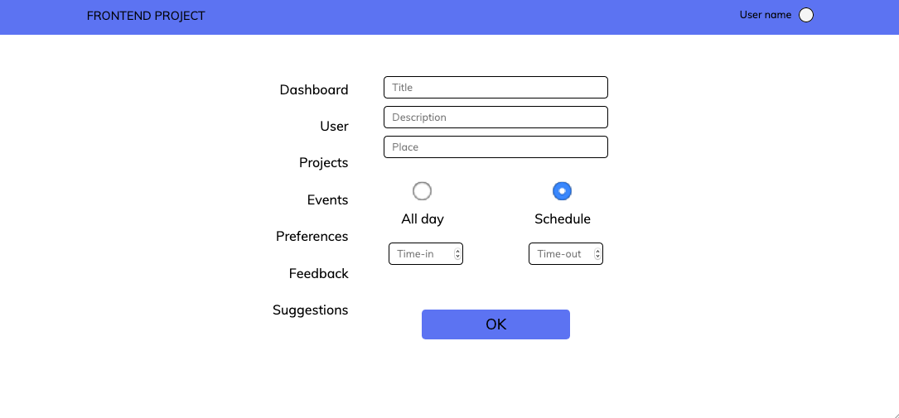

# Formulario de evento

> Formulário é um documento pré-impresso onde são preenchidos os dados e informações, que permite a formalização das comunicações, o registro e o controle das atividades das organizações, como empresas ou instituições estatais. (livrept.wikipedia.org)

______________
## Informações: 
* Os três primeiros campos são obrigatório para uma validação de formulário.
* Caso o usuário tenha preferência de entrada e de saída basta marcar o horário de entrada e de seiada com o "Schedule".
* Agora os outros campos como o "All day" diz que o evento será o dia todo e assim não é necessário preencher os campos de entrada e saída.

> 
____
## Como rodar em sua maquina

> Procure pelo arquivo "index.html" localizado na raiz do projeto, e abra-o em seu navegador de preferência.
